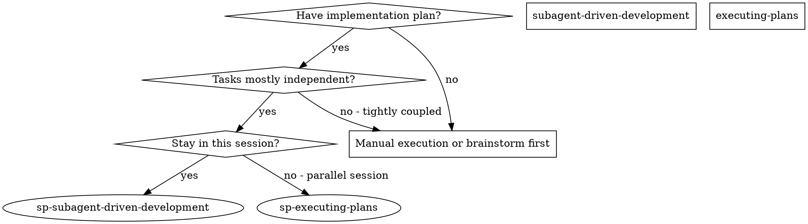
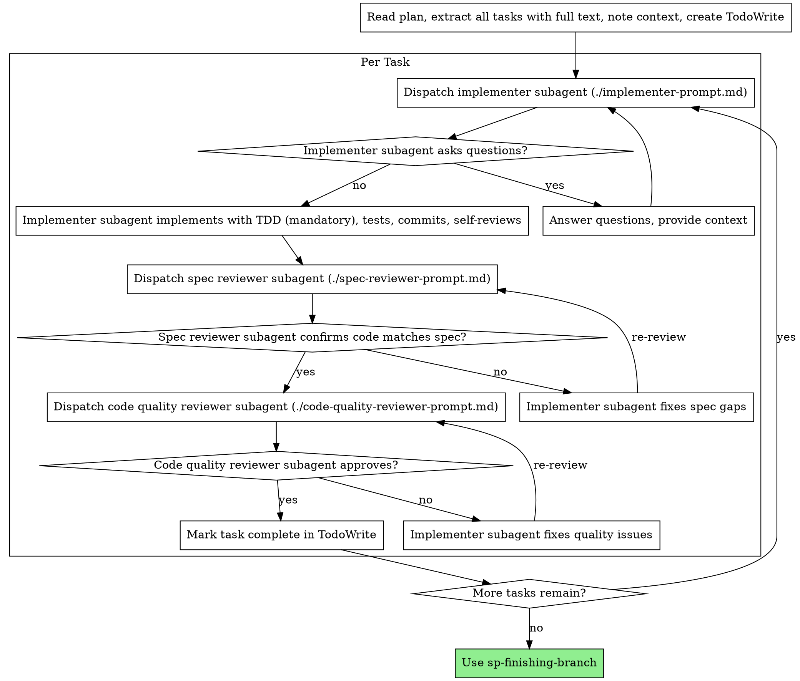

# Subagent-Driven Development

Execute plan by dispatching fresh subagent per task, with TDD implementation (mandatory) and two-stage review after each: spec compliance review first, then code quality review.

**Core principle:** Fresh subagent per task + mandatory TDD + two-stage review (spec then quality) = high quality, fast iteration

## When to Use



**vs. Executing Plans (parallel session):**
- Same session (no context switch)
- Fresh subagent per task (no context pollution)
- TDD mandatory for all tasks
- Two-stage review after each task: spec compliance first, then code quality
- Faster iteration (no human-in-loop between tasks)

## The Process



## Prompt Templates

- `./implementer-prompt.md` - Dispatch implementer subagent
- `./spec-reviewer-prompt.md` - Dispatch spec compliance reviewer subagent
- `./code-quality-reviewer-prompt.md` - Dispatch code quality reviewer subagent

## Example Workflow

```
You: I'm using Subagent-Driven Development to execute this plan.

[Read plan file once: docs/plans/feature-plan.md]
[Extract all 5 tasks with full text and context]
[Create TodoWrite with all tasks]

Task 1: Hook installation script

[Get Task 1 text and context (already extracted)]
[Dispatch implementation subagent with full task text + context]
[Subagent MUST use TDD - this is mandatory]

Implementer: "Before I begin - should the hook be installed at user or system level?"

You: "User level (~/.config/superpowers/hooks/)"

Implementer: "Got it. Using TDD to implement..."
[Later] Implementer:
  - Wrote failing tests first (RED)
  - Implemented minimal code to pass (GREEN)
  - Refactored for clarity (REFACTOR)
  - Self-review: Found I missed --force flag, added it with TDD
  - Committed

[Dispatch spec compliance reviewer]
Spec reviewer: ✅ Spec compliant - all requirements met, nothing extra

[Get git SHAs, dispatch code quality reviewer]
Code reviewer: Strengths: Good test coverage, clean. Issues: None. Approved.

[Mark Task 1 complete]

Task 2: Recovery modes

[Get Task 2 text and context (already extracted)]
[Dispatch implementation subagent with full task text + context]
[Subagent MUST use TDD]

Implementer: [No questions, proceeds with TDD]
Implementer:
  - RED: Wrote failing tests for verify/repair modes
  - GREEN: Implemented minimal code
  - REFACTOR: Cleaned up
  - 8/8 tests passing
  - Self-review: All good
  - Committed

[Dispatch spec compliance reviewer]
Spec reviewer: ❌ Issues:
  - Missing: Progress reporting (spec says "report every 100 items")
  - Extra: Added --json flag (not requested)

[Implementer fixes issues with TDD]
Implementer: Removed --json flag, added progress reporting with tests

[Spec reviewer reviews again]
Spec reviewer: ✅ Spec compliant now

[Dispatch code quality reviewer]
Code reviewer: Strengths: Solid. Issues (Important): Magic number (100)

[Implementer fixes]
Implementer: Extracted PROGRESS_INTERVAL constant

[Code reviewer reviews again]
Code reviewer: ✅ Approved

[Mark Task 2 complete]

...

[After all tasks]
[All tasks reviewed - no final review needed]

Done! Ready for sp-finishing-branch.
```

## Advantages

**vs. Manual execution:**
- Subagents MUST use TDD (mandatory)
- Fresh context per task (no confusion)
- Parallel-safe (subagents don't interfere)
- Subagent can ask questions (before AND during work)

**vs. Executing Plans:**
- Same session (no handoff)
- Continuous progress (no waiting)
- Review checkpoints automatic

**Efficiency gains:**
- No file reading overhead (controller provides full text)
- Controller curates exactly what context is needed
- Subagent gets complete information upfront
- Questions surfaced before work begins (not after)

**Quality gates:**
- TDD ensures tests exist before code (mandatory)
- Self-review catches issues before handoff
- Two-stage review: spec compliance, then code quality
- Review loops ensure fixes actually work
- Spec compliance prevents over/under-building
- Code quality ensures implementation is well-built

**Cost:**
- More subagent invocations (implementer + 2 reviewers per task)
- Controller does more prep work (extracting all tasks upfront)
- Review loops add iterations
- But catches issues early (cheaper than debugging later)

## Red Flags

**Never:**
- Start implementation on main/master branch without explicit user consent
- Skip TDD (TDD is mandatory for all tasks)
- Allow implementer to write code before tests
- Skip reviews (spec compliance OR code quality)
- Proceed with unfixed issues
- Dispatch multiple implementation subagents in parallel (conflicts)
- Make subagent read plan file (provide full text instead)
- Skip scene-setting context (subagent needs to understand where task fits)
- Ignore subagent questions (answer before letting them proceed)
- Accept "close enough" on spec compliance (spec reviewer found issues = not done)
- Skip review loops (reviewer found issues = implementer fixes = review again)
- Let implementer self-review replace actual review (both are needed)
- **Start code quality review before spec compliance is ✅** (wrong order)
- Move to next task while either review has open issues

**If subagent asks questions:**
- Answer clearly and completely
- Provide additional context if needed
- Don't rush them into implementation

**If reviewer finds issues:**
- Implementer (same subagent) fixes them
- Reviewer reviews again
- Repeat until approved
- Don't skip the re-review

**If subagent fails task:**
- Dispatch fix subagent with specific instructions
- Don't try to fix manually (context pollution)

## Integration

**Required workflow skills:**
- **sp-using-git-worktrees** - REQUIRED: Set up isolated workspace before starting
- **sp-writing-plans** - Creates the plan this skill executes
- **sp-requesting-review** - Code review template for reviewer subagents
- **sp-finishing-branch** - Complete development after all tasks

**Subagents MUST use:**
- **sp-test-driven-dev** - TDD is mandatory for each task (not optional)

## State Management

**Before each task:**
1. Update task status: `"in_progress"`
2. Record current_step: 1
3. Update workflow state file

**After each task completion:**
1. Update task status: `"completed"`
2. Record commit_sha from git
3. Record completed_at timestamp
4. Increment completed_tasks counter
5. Update workflow state file

**During task execution:**
- Update current_step as progress (1-5 for TDD cycle)
- Add notes for context if interrupted
- Save after each significant step

**After all tasks:**
1. Update current_phase: `"completed"`
2. Ready for sp-finishing-branch

**Alternative workflow:**
- **superpowers:executing-plans** - Use for parallel session instead of same-session execution
